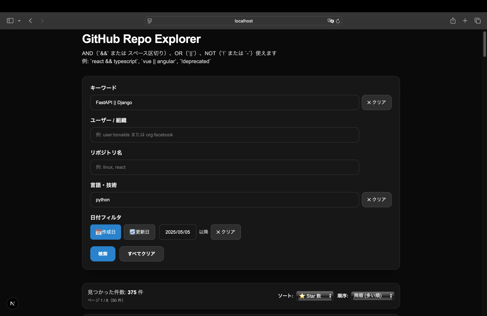
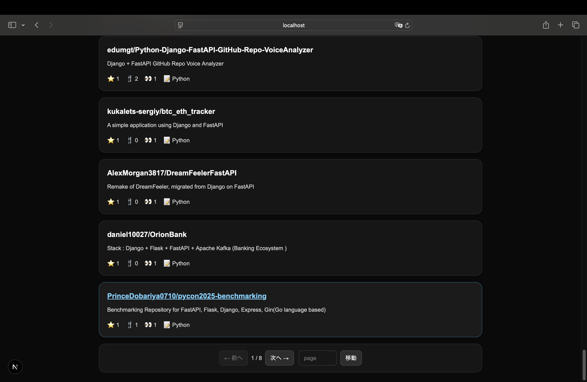

# GitHub Repo Explorer

## 概要

Next.js + FastAPI を使ったGitHubリポジトリ検索アプリ
OpenAPI + Orval によるAPIクライアント自動生成を実装

---

## 技術スタック

* Frontend: Next.js (TypeScript)
* Backend: FastAPI (Python)
* API Client: Orval

---

## 機能
# GitHub リポジトリ検索

GitHub のリポジトリをキーワード・ユーザー/組織・リポジトリ名・言語・日付で検索できる Web アプリケーションです。Next.js (TypeScript) と FastAPI (Python) を使用しています。




## 主な機能
- フリーテキスト検索（AND / OR / NOT をサポート）
- ページネーション（50件 / ページ）
- ソート（Star / Fork / Watch）と昇順/降順切替
- 日付フィルタ（作成日 / 更新日）
- 結果カードにスター数・フォーク数・Watch 数を表示

## 技術スタック
- Frontend: Next.js (TypeScript), Tailwind CSS
- Backend: FastAPI, requests, pydantic
- API client: Orval (OpenAPI → TypeScript)

## セットアップ（開発）

### frontend
```bash
cd frontend
npm install
npm run dev
```

### backend
```bash
cd backend
poetry install
poetry run uvicorn src.main:app --reload
```


### 環境変数
- `frontend/.env`:

```env
BACKEND_ORIGIN=http://127.0.0.1:8000
```

## フォーマット & Lint

### Frontend
```bash
cd frontend
npx orval
npx prettier --write .
npx eslint . --ext .ts,.tsx --fix
npm run lint
```

### Backend
```bash
cd backend
poetry run black .
poetry run ruff format .
poetry run ruff check --fix .
```
